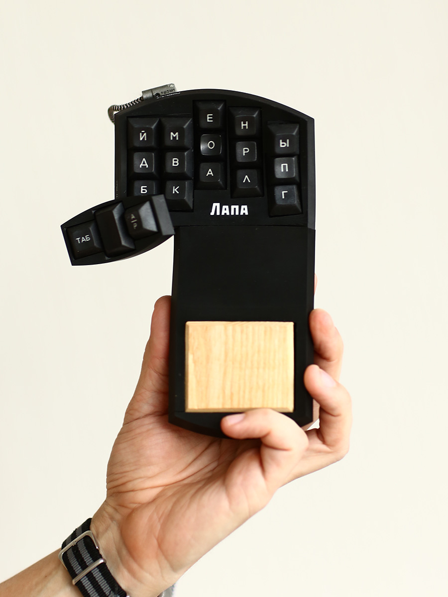
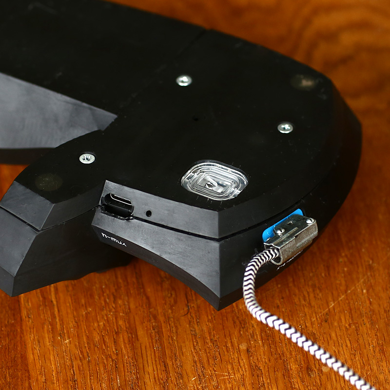

  

Lapa (Russian: Лапа, paw) - split keyboard-mouse with 36 keys (40%)  for typing without moving the hands.

## Features
1. The wrist-rest is part of the keyboard and is located above the main row keys.
2. The built-in mouse sensor allows you not to transfer your hand from the keyboard to the mouse.
3. The thumb keys are located on a separate part of the case, much higher than other keys.
4. The keys of each finger are located on several circles of different diameters, forming a "stairs". This solution provides maximum perpendicularity of the keystroke vectors to the key surfaces.
5. Minimum height. The surface of the lowest key is at a distance of 2 cm from the table.
6. The keycaps are flush with the body.
7. Replaceable oak pad for resting the wrist.
8. Reliable russian connector РШ2Н-1-6 for connecting two halves of the keyboard.
9. Magnets to connect the two halves of the keyboard for transporting.

## Layout

Especially for the keyboard, I developed russian layout that provides the maximum frequency of trigrams with rolls and the minimum frequency same finger.
English alphabet is mapped with the Russian alphabet by phonetic: а - a, с - s, ш - sh, etc.
The A/P-key is used to switch the alphabet.

## BOM
1. Pro micro - 2
2. Optical sensor board ADNS9800 - 1
3. Connector РГ1Н-1-1 - 2
4. Wire with two plugs РШ2Н-1-6 - 1
5. Cherry MX switches (blue) - 36
6. Diodes 1N4148 - 36
7. Resistor 4.7 KOm - 2
8. Button (restart) - 2
9. Bolt M3 10 mm with a conical head - 10
10. Nut M3 - 10

