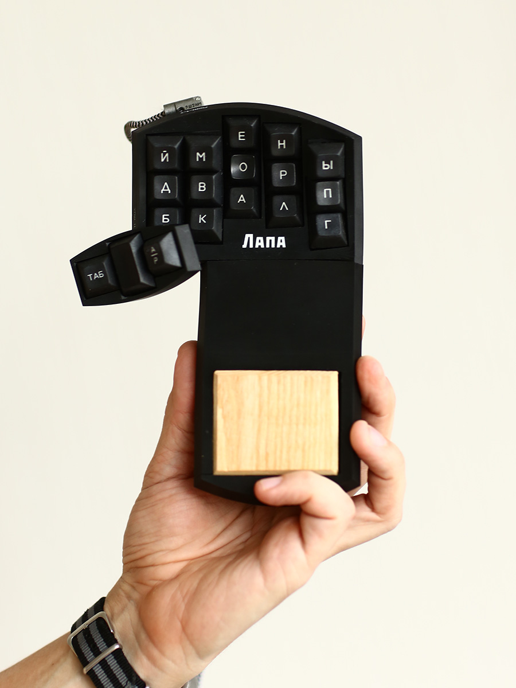
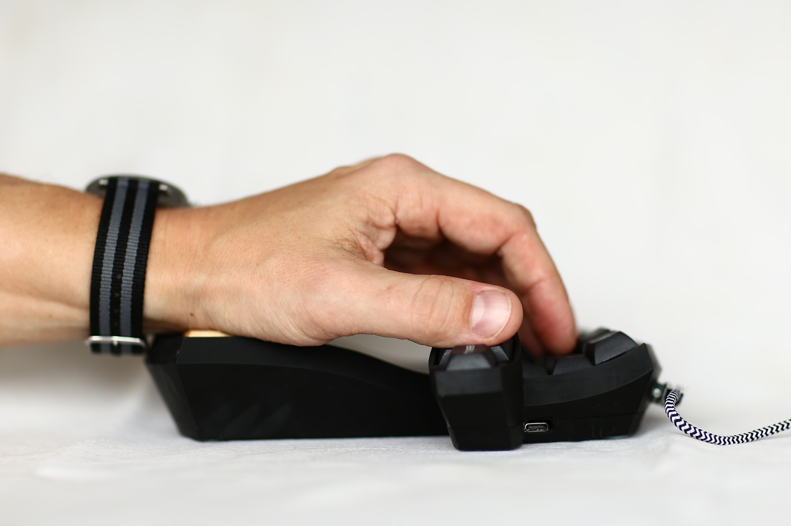
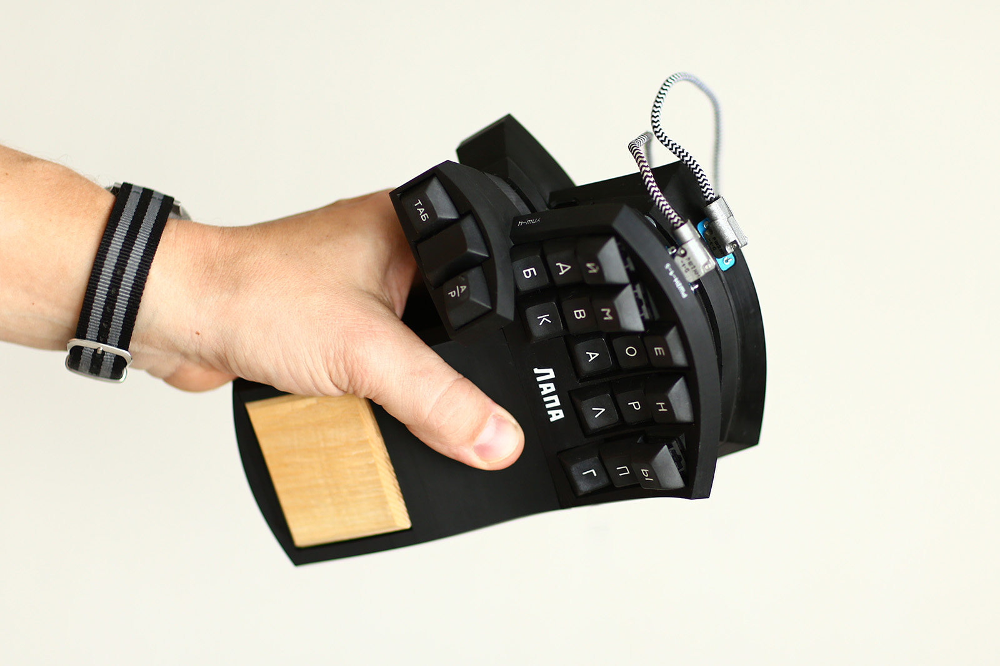
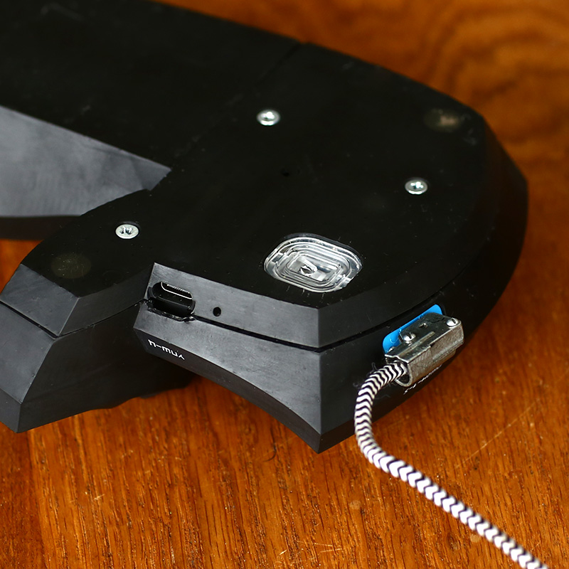
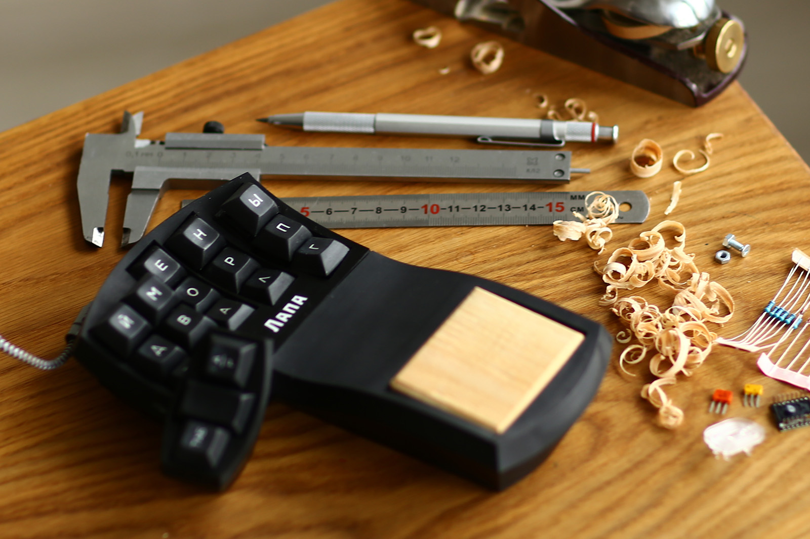
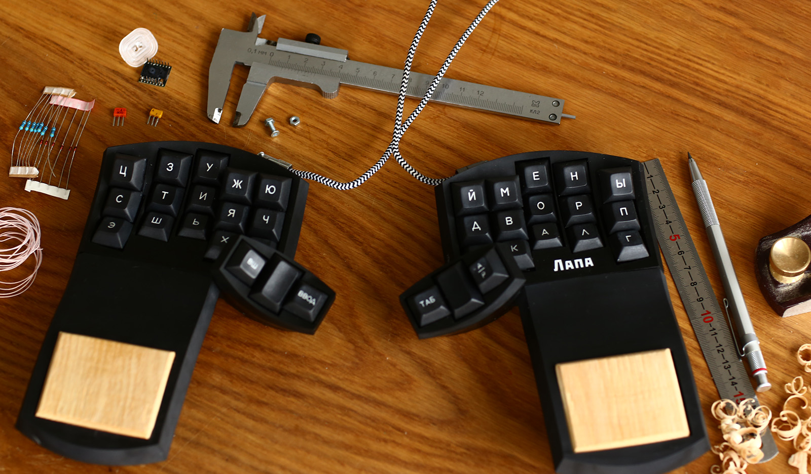
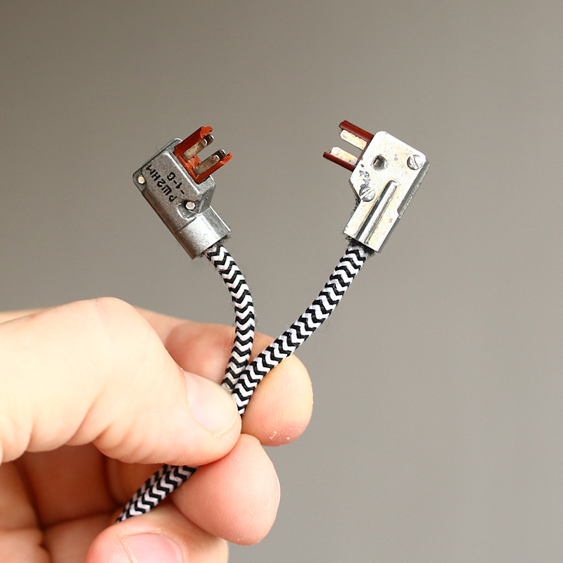
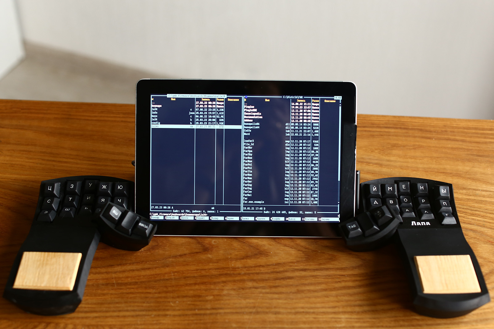

  

Лапа — раздельная клавиатура-мышь из 36 клавиш (40 % от стандартной клавиатуры) объемного расположения для 10-пальцевой «слепой» печати без передвижения рук.

## Требования при проектировании 
1. Запястья рук не должны передвигаться при работе (концепция запястьестабильности).
2. Векторы нажатий каждой клавиши должны быть перпендикулярны поверхности клавиш.

## Ключевые отличия от других объемных клавиатур
1. Подставка запястья является частью корпуса клавиатуры и расположена выше клавиш основного ряда.
2. Встроенный датчик мыши позволяет не переносить руку с клавиатуры на мышь.
3. Клавиши большого пальца расположены на отдельной части корпуса значительно выше остальных клавиш.
4. Клавиши каждого пальца расположены не на одной, а на нескольких окружностях разных диаметров, образуя «лесенку». Такое решение обеспечивает максимальную перпендикулярность векторов нажатий поверхностям клавиш.
5. Минимальная высота. Поверхность самой нижней клавиши находится на расстоянии 2 см от поверхности стола (для этого в корпусе проделанно отверстие, так что шип самого низкого переключателя упирается в стол).
6. Нажимные поверхности клавиш (колпачки) расположены заподлицо с корпусом.
7. Сменная дубовая накладка для упора запястья.
8. Надежный разъем РШ2Н-1-5 для связи двух половин клавиатуры.
9. Магниты для соединения двух половин клавиатуры при транспортировке.

## Раскладка
Специально для клавиатуры разрабтана раскладка обеспечивающая максимальную частоту триграмм с перекатами и минималную частоту последовательных нажатий одним пальцем.

## Не маловато ли клавиш
Для симметричности на каждой половине по 15 алфавитных клавиш. Недостающие буквы вводятся аккордами: буква `щ` набирается одновременным нажатием букв `шь`, буква `ё` одновременным нажатием букв `йо`, а буква `ъ` набирается буквой `й` если она нажимается после букв `дсзтв`.
Аналогично набираются пунктуационные знаки и командные клавиши. Цифры набираются на левой половине при зажатой большой клавише.
Специально для клавиатуры разрабтана система аккордных комбинаций, учитывающая перекаты.

## Сборка
Сборка осуществляется навесным монтажом.
Модели и инструкция по сборке будут доступны в ближайшее время.

## Список компонентов
1. Микропроцессор Pro micro — 2 шт
2. Плата оптического датчика ADNS9800 — 1 шт
3. Разъем РГ1Н-1-1 — 2 шт
4. Провод с вилкой РШ2Н-1-6 — 2 шт
5. Переключатели Cherry MX (синие) — 36 шт
6. Диоды 1N4148 — 36 шт
7. Резистор — 2 шт
8. Кнопка (перезапуска) — 2 шт
9. Болт М3 10 мм с конусной шляпкой — 10 шт
10. Гайка М3 — 10 шт

