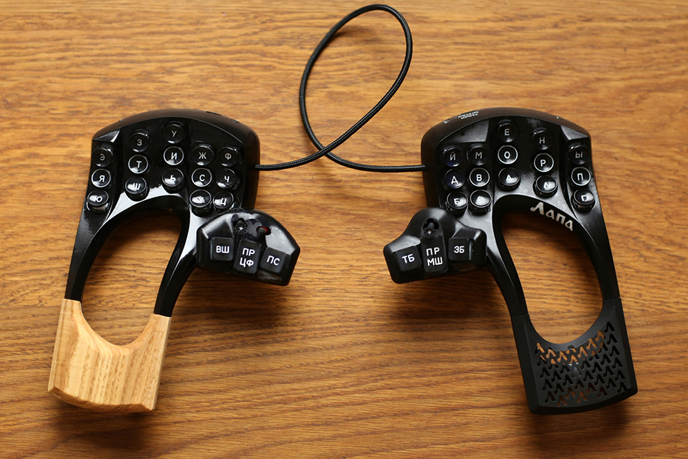
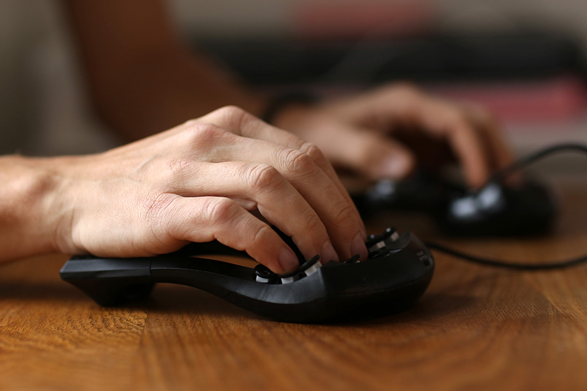
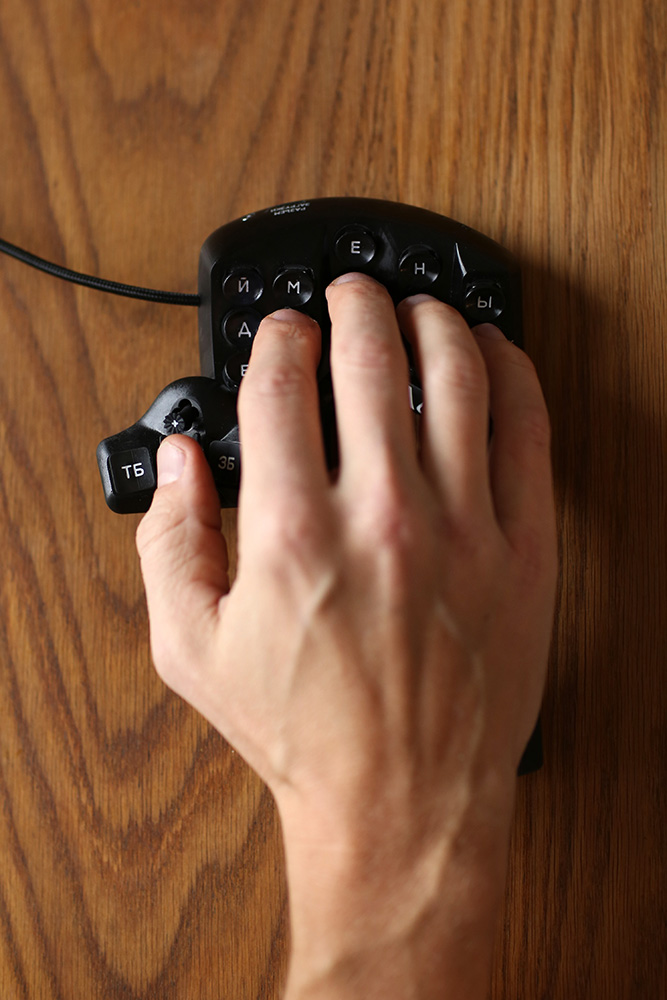
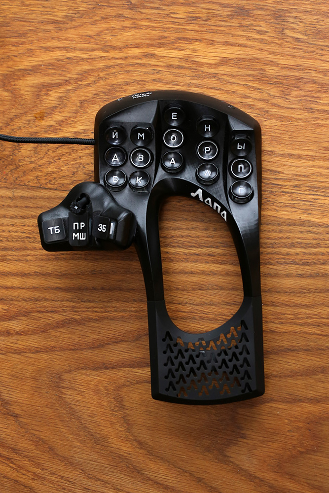
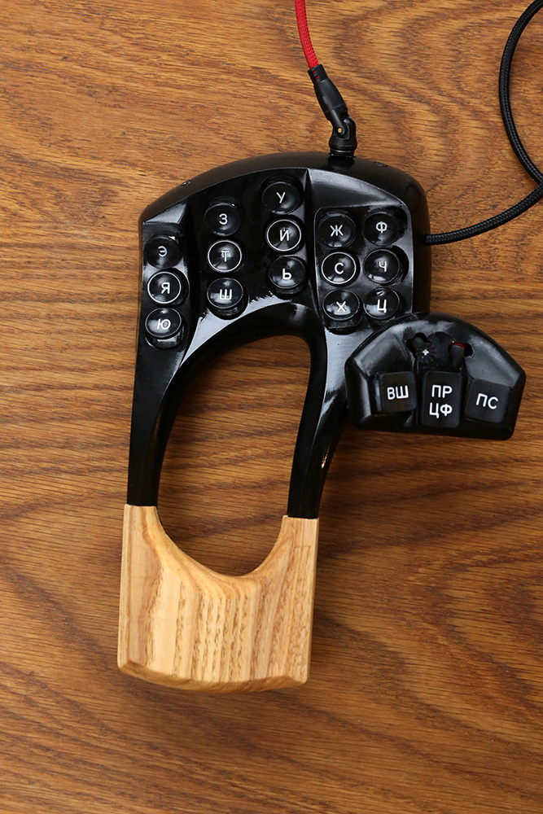
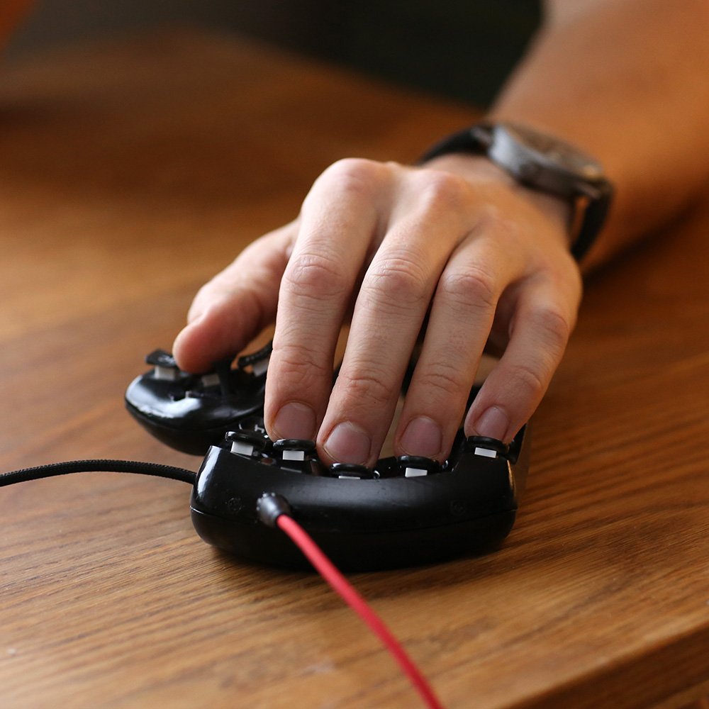
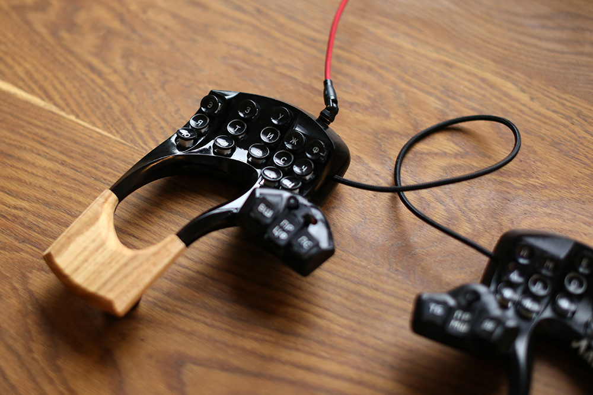
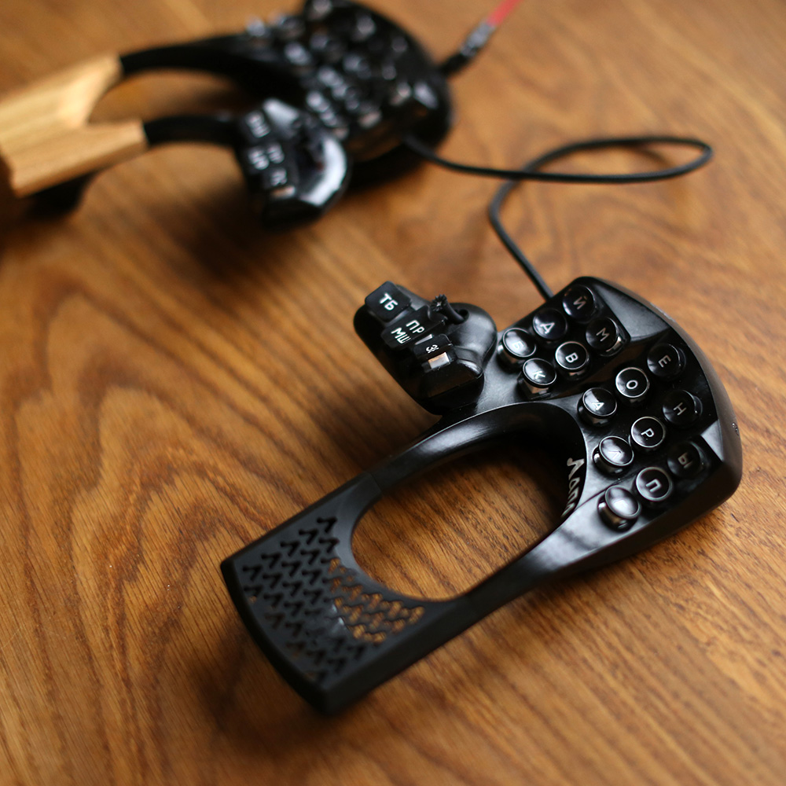
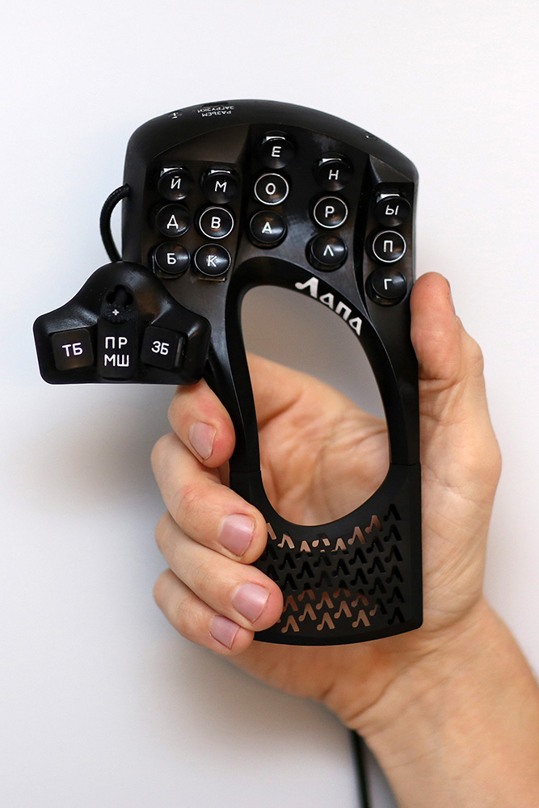

  

Лапа — раздельная клавиатура-мышь из 36 клавиш (40 % от стандартной клавиатуры) объемного расположения для 10-пальцевой «слепой» печати без передвижения рук.

## Конструкция 
Основная задача Лапы в том, чтобы пользователь мог сосредоточится на основной работе и уменьшить суету при использовании клавиатуры:
- минимизация движения рук и пальцев (я не хочу постоянно двигать руку на мышь и не хочу двигать пальцы из угла в угол клавиатуры)
- минимизация визуального внимания на клавиатуре (я не хочу переводить взгляд с экрана на клавиатуру и обратно, все движения пальцев должны быть интуитивно-понятны). Поэтому я не планирую делать экраны и световую индикацию.
Мне было важно, чтобы руки были расположенны наиболее естественно, но при этом могли моментально набирать текст.
Не руки приспосабливаются к клавиатуре, а клавиатура приспосабливается к рукам.

## Особенности
- левая половина — мышь. Самая важная функция. Мне не нужно переводить руку на мышь и суетится.
- джойстик большого пальца на правой половине. Я использую его вместо курсорных клавиш и это очень удобно. Джойстик имеет форму репья, так что палец легко цепляет его и не соскальзывает.
- тумблер большого пальца на левой половине. Я использую его для переключения клавиатуры с русского алфавита на английский. Положение тумблера определяется тактильно, так что мне не нужны дополнительные индикаторы, чтобы понять в каком алфавите сейчас клавиатура.
- джойстик большого пальца на левой половине. Я использую его для перехода между вкладками и программами.
- соленоид под левым запястьем. При переключении слоев (в том числе автоматическом переключении), соленоид стучит определенное количество раз, так что я знаю в каком я слое.
При более редком наборе английскими буквами соленоид всегда слегка стучит, так что я не путаю, русские буквы с английскими.

https://github.com/user-attachments/assets/b1af6ffc-af0c-42e1-acf5-c68db2ef7b85

## Клавиши
Мне было важно, чтобы нажатия были максимально легкими и тактильными.
Я использую переключатели Kailh White V2 с пружинами на 30 г.
Переключатели расположены так, что их центральная ось совпадает к осью нижней фаланги пальца при нажатии.
Чтобы облегчить нажатия я сделал очень легкие колпачки овальной формы — формы подушечек моих пальцев. И формы колпачков старинных пишущих машин.
Это позволило мне набирать текст значительно проще и точнее, чем на колпачках квадратной формы.
Сначала круглые колпачки казались мне странными, но очень скоро я понял, что для объемных клавиатур они намного более эстетичны, чем квадратные.
Но возникла проблема зазоров между клавиш. Сквозь них были видны переключатели и это было очень уродливо.
Поэтому я сделал корпус с установкой переключателей не сверху, а снизу. Я полностью повторил посадочную форму (клин) переключателя в корпусе, так что они держатся только на трении без защелок и клея.

https://github.com/user-attachments/assets/f2050ea4-d87f-4df2-8be0-e7f55826e3db

## Мышь
Самая сложная задача — использовать клавиатуру как мышь. Трудно сделать ее такой формы, чтобы она легко перемещалась как мышь, но при этом не сдвигалась при интенсивном наборе.
Легкий прижим запястьем позволяет управлять клавиатурой как мышкой и не перемещать ее при быстром наборе.
Для лучшего маневрирования я добился минимального веса правой половины — 133 г, что меньше веса мышки MX Master.
Правая опора запястья максимально облегчена и имеет перфорацию, улучшающую контакт руки.

## Раскладка

Специально для клавиатуры разрабтана раскладка обеспечивающая максимальную частоту триграмм с перекатами и минималную частоту последовательных нажатий одним пальцем.
Для симметричности на каждой половине по 15 алфавитных клавиш. Недостающие буквы вводятся аккордами: буква щ набирается одновременным нажатием букв шь, буква ё одновременным нажатием букв йо, а буква ъ набирается буквой й если она нажимается после букв дсзтв. Аналогично набираются пунктуационные знаки и командные клавиши. Цифры набираются на левой половине при зажатой большой клавише. Специально для клавиатуры разрабтана система аккордных комбинаций, учитывающая перекаты.

## Список компонентов
1. Микропроцессор RP2040 — 2 шт
2. Плата оптического датчика ADNS9800 — 1 шт
3. Переключатели Kailh Box White v2 — 36 шт
4. Диоды 1N4148 - 37
5. Резисторы 4,7 KOm - 2
6. Болтики M2,5 6 мм с конусной головкой - 4
7. Гайки M2,5 - 4
8. 5-позиционный переключатель - 2
9. тумблер Q24 - 1
10. Соленоид 8-20 (3v) - 1

## [2024 version](v24.md)
## [2023 version](v23.md)

