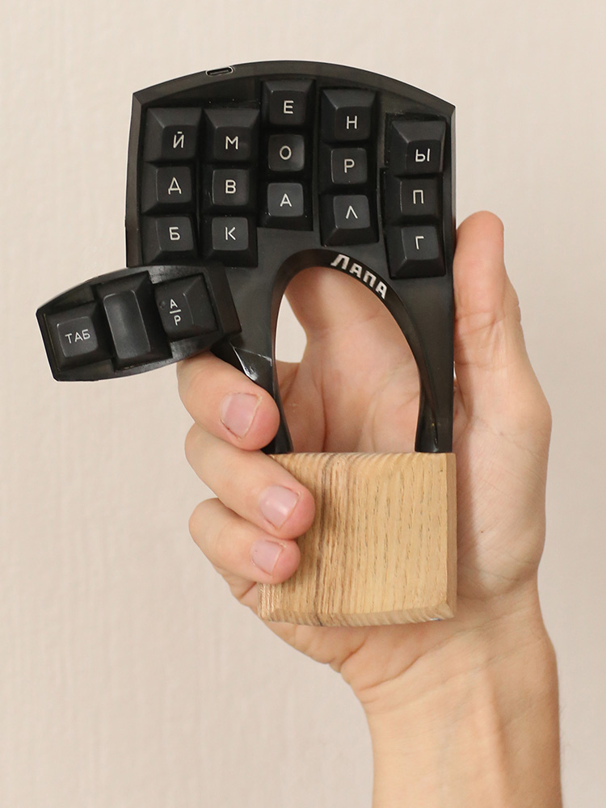

## BOM
1. Pro micro - 2
2. Optical sensor board ADNS9800 - 1
3. Cherry MX switches (blue) - 36
4. Diodes 1N4148 - 36
5. Resistor 4.7 KOm - 2
6. Bolt M2.5 6 mm with a conical head - 4
7. Nut M2.5 - 4
8. Bolt M4 80 mm with a conical head - 4
